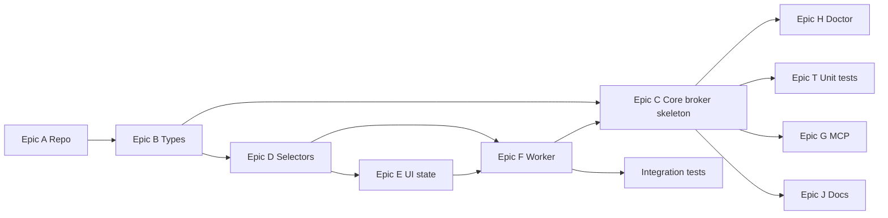

# Perplexity Desktop Broker — MVP Backlog

Local Node.js + Playwright broker: Cursor → MCP (thin) → HTTP broker → Playwright worker → logged-in Perplexity web UI.

**Platforms:** macOS (P0), Linux desktop (P1 parity). **Out of scope:** Windows, Docker-default, headless-first, fleet, auto-login, anti-bot bypass.

**Session invariant:** one profile, one active tab, one in-flight generation per `session_id`; overlapping requests are rejected as BUSY (no queue), never race the same tab.

---

## Skill map (apply when implementing)

| Area | Global / project skill |
|------|-------------------------|
| Scope, API, errors, phases | `perplexity-desktop-broker` (project) |
| Monorepo HTTP broker | `nodejs-backend-patterns`, `fastify-best-practices` |
| REST contracts | `api-design-principles` |
| DTOs, error unions, config types | `typescript-advanced-types` |
| Job queue, async, timeouts | `modern-javascript-patterns` |
| Playwright worker, locators, waits | `playwright-best-practices` |
| Selector debugging / CLI | `playwright-cli`, `dev` |
| MCP adapter | `mcp-builder` |
| Unit / integration tests | `javascript-testing-patterns` |

---

## Milestones

| Milestone | Exit criteria |
|-----------|----------------|
| **M0 — Repo boots** | `pnpm install`, `pnpm build`, empty broker listens on `127.0.0.1:3317`, `GET /health` → `{ ok: true, browser: "down" }` |
| **M1 — P0 usable** | Manual login once; `doctor` green; Cursor can `send_prompt` + get structured answer via HTTP (MCP optional) |
| **M2 — P1 complete** | MCP tools wired; cancel, upload, artifacts on failure; 10× manual acceptance pass |
| **M3 — P2 polish** | Model/reasoning control (Epic L), history, queue/rate-limit handling documented and tested |

---

## Epic L — Perplexity model & reasoning (P1 → P2)

**Gap today:** no API to set or read active Perplexity **model** / **reasoning**; answers do not return which model was used. UI picker is best-effort in `packages/ui-selectors/src/model.ts` only.

| ID | Pri | Task | Package / path | Skills | Deps |
|----|-----|------|----------------|--------|------|
| L-01 | P1 | Map Perplexity UI: model picker, reasoning toggle (on/off), labels in DOM | `packages/ui-selectors/src/model.ts`, fixture HTML | `playwright-best-practices` | D-01 |
| L-02 | P1 | `getModelSettings()` — return `{ model: string, reasoning: boolean }` from current page | `packages/playwright-worker/src/model.ts` | project skill | L-01, F-03 |
| L-03 | P1 | `setModelSettings({ model, reasoning })` — apply before send when `ALLOW_MODEL_SWITCH=1` | `packages/playwright-worker/src/model.ts` | project skill | L-01, F-06 |
| L-04 | P1 | Config/env defaults: `PERPLEXITY_MODEL`, `PERPLEXITY_REASONING` (install-time preference) | `packages/core/src/config.ts`, `.env.example` | project skill | L-03, C-01 |
| L-05 | P1 | Doctor check: report configured vs detected model + reasoning | `apps/doctor/src/checks/model.ts` | project skill | L-02, H-03 |
| L-06 | P1 | Extend answer payload: `model_used`, `reasoning_enabled` on every successful chat | `packages/types`, `extract` / `broker-service`, MCP `perplexity_ask` | `api-design-principles` | L-02, F-10 |
| L-07 | P2 | HTTP: `GET /model/settings`, `POST /model/settings` (optional MCP params on `perplexity_ask`) | `apps/broker`, `apps/mcp-server` | `mcp-builder` | L-02, L-03, L-06 |
| L-08 | P2 | Integration test `@live`: set model → send → assert `model_used` in response | `tests/integration/model.test.ts` | `playwright-best-practices` | L-06, T-07 |

**Acceptance:** agent can rely on `model_used` + `reasoning_enabled` in `perplexity_ask` success JSON; operator can set defaults via env and verify via doctor.

---

## Epic A — Repository & toolchain (P0)

| ID | Pri | Task | Package / path | Skills | Deps |
|----|-----|------|----------------|--------|------|
| A-01 | P0 | Init pnpm workspace: root `package.json`, `pnpm-workspace.yaml`, `tsconfig` base, ESLint | `/` | `typescript-advanced-types`, `nodejs-backend-patterns` | — |
| A-02 | P0 | Create packages: `types`, `core`, `ui-selectors`, `ui-state`, `playwright-worker` | `packages/*` | project skill layout | A-01 |
| A-03 | P0 | Create apps: `broker`, `mcp-server`, `doctor` | `apps/*` | project skill | A-01 |
| A-04 | P0 | Shared scripts: `pnpm dev:broker`, `dev:mcp`, `doctor`, `build`, `test`, `test:integration` | root `package.json` | `fastify-best-practices` | A-02, A-03 |
| A-05 | P0 | `.env.example`, `config/default.json`, gitignore `data/`, `node_modules/` | `config/`, root | project skill config | A-01 |
| A-06 | P0 | `README.md`: prerequisites (Node 20+, Playwright browsers), one-time login flow | `docs/` | — | A-04 |

---

## Epic B — Types & contracts (P0)

| ID | Pri | Task | Package / path | Skills | Deps |
|----|-----|------|----------------|--------|------|
| B-01 | P0 | Error codes enum + `BrokerError` shape (`code`, `message`, `last_ui_state`, `artifacts`) | `packages/types/src/errors.ts` | project skill, `typescript-advanced-types` | A-02 |
| B-02 | P0 | Job model: `Job`, `JobStatus`, actions, payloads | `packages/types/src/jobs.ts` | project skill | A-02 |
| B-03 | P0 | HTTP request/response DTOs for all MVP endpoints | `packages/types/src/api.ts` | `api-design-principles` | B-01, B-02 |
| B-04 | P0 | `Answer`, `Source`, `Timings`, `response_format` union | `packages/types/src/chat.ts` | `api-design-principles` | B-03 |
| B-05 | P0 | Zod or JSON Schema mirrors for Fastify route validation | `packages/types/src/schemas/` | `fastify-best-practices` | B-03 |

---

## Epic C — Core broker (P0 → P1)

| ID | Pri | Task | Package / path | Skills | Deps |
|----|-----|------|----------------|--------|------|
| C-01 | P0 | Typed config loader from `.env` (host, port, paths, flags) | `packages/core/src/config.ts` | `typescript-advanced-types`, project skill | B-01, A-05 |
| C-02 | P0 | Structured JSON logger + step names (`browser.launch`, …) | `packages/core/src/logger.ts` | project skill (observability) | C-01 |
| C-03 | P0 | Job state machine: transitions + illegal transition guard | `packages/core/src/job-fsm.ts` | `modern-javascript-patterns` | B-02 |
| C-04 | P0 | In-memory job store + file snapshot optional (`data/state/`) | `packages/core/src/job-store.ts` | project skill | C-03 |
| C-05 | P0 | Session mutex: one worker action per `session_id` (BUSY on overlap) | `packages/core/src/session-lock.ts` | project skill | C-03 |
| C-06 | P0 | `BrokerService` orchestrating worker calls inside jobs | `packages/core/src/broker-service.ts` | `nodejs-backend-patterns` | C-04, C-05, E-* |
| C-07 | P0 | Fastify app: bind `127.0.0.1`, helmet, JSON body limits | `apps/broker/src/server.ts` | `fastify-best-practices` | C-01 |
| C-08 | P0 | `POST /session/ensure` | `apps/broker/src/routes/session.ts` | `api-design-principles` | C-06, C-07 |
| C-09 | P0 | `POST /thread/new` | `apps/broker/src/routes/thread.ts` | `api-design-principles` | C-06 |
| C-10 | P0 | `POST /chat/send` (sync `wait: true` path for MVP) | `apps/broker/src/routes/chat.ts` | `api-design-principles` | C-06, F-* |
| C-11 | P0 | `GET /job/:id` | `apps/broker/src/routes/jobs.ts` | `api-design-principles` | C-04 |
| C-12 | P1 | `POST /chat/cancel` | `apps/broker/src/routes/chat.ts` | project skill | C-10, F-08 |
| C-13 | P1 | `POST /attachment/upload` + `ALLOW_FILE_UPLOAD` gate | `apps/broker/src/routes/attachment.ts` | `playwright-best-practices` (file ops) | C-06, F-09 |
| C-14 | P1 | `GET /health` (broker + browser + session summary) | `apps/broker/src/routes/health.ts` | `fastify-best-practices` | C-06 |
| C-15 | P1 | Global error handler → normalized `BrokerError` JSON | `apps/broker/src/plugins/errors.ts` | `nodejs-backend-patterns`, B-01 | C-07 |
| C-16 | P1 | Idempotency: `idempotency_key` dedup window | `packages/core/src/idempotency.ts` | `api-design-principles` | C-04 |

---

## Epic D — UI selectors (P0)

All locators **only** under `packages/ui-selectors/`. No selectors in worker/broker.

| ID | Pri | Task | Package / path | Skills | Deps |
|----|-----|------|----------------|--------|------|
| D-01 | P0 | Locator helper: primary + fallback + `isVisible` | `packages/ui-selectors/src/locator.ts` | `playwright-best-practices` (locators) | A-02 |
| D-02 | P0 | `input.ts` — prompt textarea (role/placeholder) | `packages/ui-selectors/src/input.ts` | `playwright-best-practices` | D-01 |
| D-03 | P0 | `buttons.ts` — submit, stop/cancel, new thread | `packages/ui-selectors/src/buttons.ts` | `playwright-best-practices` | D-01 |
| D-04 | P0 | `thread.ts` — thread list / new chat affordances | `packages/ui-selectors/src/thread.ts` | `playwright-best-practices` | D-01 |
| D-05 | P0 | `answer.ts` — last assistant message container | `packages/ui-selectors/src/answer.ts` | `playwright-best-practices` | D-01 |
| D-06 | P0 | `auth.ts` — logged-in vs login-required signals | `packages/ui-selectors/src/auth.ts` | `playwright-best-practices` (auth) | D-01 |
| D-07 | P1 | `attachment.ts` — file input / upload UI | `packages/ui-selectors/src/attachment.ts` | `playwright-best-practices` (file ops) | D-01 |
| D-08 | P1 | `model.ts` — model/mode picker (if present) | `packages/ui-selectors/src/model.ts` | project skill | D-01 |
| D-09 | P0 | Export barrel `index.ts` | `packages/ui-selectors/src/index.ts` | — | D-02–D-06 |

---

## Epic E — UI state detector (P0)

| ID | Pri | Task | Package / path | Skills | Deps |
|----|-----|------|----------------|--------|------|
| E-01 | P0 | `UiState` enum + `lastKnownState` tracker | `packages/ui-state/src/types.ts` | project skill | A-02 |
| E-02 | P0 | `detect(page)` — ready, generating, complete | `packages/ui-state/src/detector.ts` | `playwright-best-practices` (assertions-waiting) | D-*, E-01 |
| E-03 | P0 | Error states: network, rate limit, auth expired | `packages/ui-state/src/errors.ts` | project skill | E-02 |
| E-04 | P1 | Dialog, uploading, streaming partial answer | `packages/ui-state/src/detector.ts` | `playwright-best-practices` | E-02 |
| E-05 | P0 | `waitForState(page, target, timeout)` — no fixed sleep | `packages/ui-state/src/wait.ts` | `playwright-best-practices` (flaky-tests) | E-02 |
| E-06 | P0 | HTML fixture tests for detector (saved Perplexity snapshots) | `packages/ui-state/__tests__/` | `javascript-testing-patterns` | E-02, T-03 |

---

## Epic F — Playwright worker (P0 → P1)

| ID | Pri | Task | Package / path | Skills | Deps |
|----|-----|------|----------------|--------|------|
| F-01 | P0 | `BrowserSessionManager`: `launchPersistentContext`, headed default | `packages/playwright-worker/src/session.ts` | `playwright-best-practices`, project skill | C-01 |
| F-02 | P0 | Profile dir `data/profile`, viewport, `PERPLEXITY_URL` navigation | `packages/playwright-worker/src/session.ts` | project skill | F-01 |
| F-03 | P0 | `ensureSession()` — open/reuse tab, `auth.check` | `packages/playwright-worker/src/session.ts` | project skill | F-02, D-06, E-02 |
| F-04 | P0 | `openHome()` | `packages/playwright-worker/src/navigation.ts` | — | F-03 |
| F-05 | P0 | `newThread()` | `packages/playwright-worker/src/thread.ts` | D-03, D-04 | F-03 |
| F-06 | P0 | `sendPrompt(text, options)` — fill + submit | `packages/playwright-worker/src/chat.ts` | `playwright-best-practices` | D-02, D-03, E-05 |
| F-07 | P0 | `waitForCompletion(timeout)` — state-driven | `packages/playwright-worker/src/chat.ts` | E-05 | F-06 |
| F-08 | P1 | `cancelGeneration()` | `packages/playwright-worker/src/chat.ts` | D-03 | F-06 |
| F-09 | P1 | `uploadFile(path)` | `packages/playwright-worker/src/attachment.ts` | `playwright-best-practices` | D-07 |
| F-10 | P0 | `getLastAnswer(format)` — text, markdown, html_fragment | `packages/playwright-worker/src/extract.ts` | project skill | D-05, F-07 |
| F-11 | P0 | `extractSources()` best-effort | `packages/playwright-worker/src/extract.ts` | project skill | F-10 |
| F-12 | P1 | Session recovery after crash — relaunch without cookie wipe | `packages/playwright-worker/src/recovery.ts` | project skill | F-01 |
| F-13 | P1 | Ring buffer last 20 actions | `packages/playwright-worker/src/action-log.ts` | project skill | F-01 |
| F-14 | P1 | On failure: screenshot + HTML snapshot → `data/artifacts/` | `packages/playwright-worker/src/artifacts.ts` | `playwright-best-practices` (debugging) | C-01 |
| F-15 | P2 | `listThreadMessages(limit)`, `getThreadMetadata()` | `packages/playwright-worker/src/history.ts` | project skill | F-10 |
| F-16 | P2 | Superseded by Epic L (`setModelSettings` / `getModelSettings`) | `packages/playwright-worker/src/model.ts` | D-08, Epic L | F-03 |

---

## Epic G — MCP server (P1)

Thin HTTP client only — **no** job FSM or Playwright in MCP layer (`mcp-builder`).

| ID | Pri | Task | Package / path | Skills | Deps |
|----|-----|------|----------------|--------|------|
| G-01 | P1 | MCP project setup: `@modelcontextprotocol/sdk`, stdio transport | `apps/mcp-server/src/index.ts` | `mcp-builder` | A-03 |
| G-02 | P1 | Shared broker HTTP client (`BROKER_HOST:PORT`) | `apps/mcp-server/src/broker-client.ts` | `mcp-builder` | C-07 |
| G-03 | P1 | **Done:** single tool `perplexity_ask` (health/ensure/send internal) | `apps/mcp-server/src/index.ts` | `mcp-builder` | G-02, C-10 |
| G-04 | P1 | Agent error codes: `NEEDS_LOGIN`, `BROKER_OFFLINE`, `BUSY`, `TIMEOUT`, `FAILED` | `apps/mcp-server/src/agent-codes.ts` | `mcp-builder` | G-03 |
| G-05 | P1 | Example `.cursor/mcp.json` snippet for local stdio server | `docs/mcp-cursor-setup.md` | `mcp-builder` | G-01 |
| G-06 | P2 | Optional `model` / `reasoning` on `perplexity_ask` | `apps/mcp-server` | Epic L | G-03, L-07 |

---

## Epic H — Doctor CLI (P0 → P1)

| ID | Pri | Task | Package / path | Skills | Deps |
|----|-----|------|----------------|--------|------|
| H-01 | P0 | Check Node version, Playwright browsers installed | `apps/doctor/src/checks/env.ts` | `playwright-cli`, `dev` | A-03 |
| H-02 | P0 | Check `PROFILE_DIR` writable, `data/` layout | `apps/doctor/src/checks/paths.ts` | project skill | A-05 |
| H-03 | P0 | Launch headed browser, open Perplexity, report `logged_in` | `apps/doctor/src/checks/session.ts` | `playwright-best-practices` | F-01, D-06 |
| H-04 | P0 | Check broker reachability if `--broker` flag | `apps/doctor/src/checks/broker.ts` | — | C-14 |
| H-05 | P1 | Human-readable report + exit codes for CI | `apps/doctor/src/cli.ts` | — | H-01–H-04 |

---

## Epic I — Testing (P0 → P1)

| ID | Pri | Task | Package / path | Skills | Deps |
|----|-----|------|----------------|--------|------|
| T-01 | P0 | Vitest workspace config, shared test utils | `vitest.config.ts`, `packages/*/vitest` | `javascript-testing-patterns` | A-01 |
| T-02 | P0 | Unit: config parse, job FSM, idempotency | `packages/core/__tests__/` | `javascript-testing-patterns` | C-01, C-03 |
| T-03 | P0 | Unit: ui-state on HTML fixtures | `packages/ui-state/__tests__/` | `javascript-testing-patterns` | E-06 |
| T-04 | P0 | Unit: error normalization | `packages/core/__tests__/errors.test.ts` | `javascript-testing-patterns` | B-01, C-15 |
| T-05 | P0 | Fastify `inject()` tests for routes (mocked worker) | `apps/broker/__tests__/` | `fastify-best-practices`, `javascript-testing-patterns` | C-07–C-11 |
| T-06 | P1 | Integration: profile boot + login check (skipped in CI without secret profile) | `tests/integration/session.test.ts` | `playwright-best-practices`, `javascript-testing-patterns` | F-03 |
| T-07 | P1 | Integration: send prompt + extract (manual gate `@live`) | `tests/integration/chat.test.ts` | `playwright-best-practices` | F-06, F-10 |
| T-08 | P1 | Integration: cancel mid-generation | `tests/integration/cancel.test.ts` | project skill | F-08 |
| T-09 | P1 | Tag tests: `@smoke`, `@live` for selective runs | root scripts | `playwright-best-practices` (test-tags) | T-06 |

---

## Epic J — Docs & acceptance (P1)

| ID | Pri | Task | Package / path | Skills | Deps |
|----|-----|------|----------------|--------|------|
| J-01 | P1 | `docs/architecture.md` — 4-layer diagram | `docs/` | project skill | M1 |
| J-02 | P1 | `docs/runbook.md` — login, restart, `UI_CHANGED` recovery | `docs/` | project skill | H-05 |
| J-03 | P1 | `docs/troubleshooting.md` — error codes → actions | `docs/` | project skill | B-01 |
| J-04 | P1 | Manual acceptance script: 10× happy path checklist | `docs/acceptance.md` | project skill | M2 |

---

## Epic K — P2 enhancements

| ID | Pri | Task | Package / path | Skills | Deps |
|----|-----|------|----------------|--------|------|
| K-01 | P2 | Async jobs: `wait: false` + poll `GET /job/:id` | `packages/core/`, `apps/broker/` | `modern-javascript-patterns` | C-10, C-11 |
| K-02 | P2 | Rate-limit detection → `RATE_LIMITED` + backoff hint | `packages/ui-state/` | project skill | E-03 |
| K-03 | P2 | Queue policy config: `reject` vs `fifo` for concurrent requests | `packages/core/src/session-lock.ts` | project skill | C-05 |
| K-04 | P2 | Optional SQLite job/event log | `packages/core/src/job-store-sqlite.ts` | `nodejs-backend-patterns` | C-04 |
| K-05 | P2 | Linux desktop parity notes in README | `docs/` | project skill | M2 |

---

## Recommended implementation order (critical path)

**First sprint (P0 only):** A-01 → A-06 → B-01–B-05 → C-01–C-11 → D-01–D-09 → E-01–E-06 → F-01–F-11 → H-01–H-03 → T-01–T-05.

**Second sprint (P1):** C-12–C-16, F-08–F-14, G-01–G-11, H-04–H-05, T-06–T-09, J-01–J-04.

**Third sprint (P2):** F-15–F-16, K-01–K-05.

---

## Task counts

| Priority | Tasks |
|----------|------:|
| P0 | 47 |
| P1 | 32 |
| P2 | 9 |
| **Total** | **88** |

(Includes granular selector/worker tasks; bundle into PRs as needed.)

---

## Suggested PR slices

1. **PR-1** A + B — monorepo + types  
2. **PR-2** D + E — selectors + ui-state + fixture tests  
3. **PR-3** F (P0) — playwright worker  
4. **PR-4** C (P0) — broker HTTP happy path  
5. **PR-5** H + T-05 — doctor + route tests  
6. **PR-6** G — MCP adapter + Cursor docs  
7. **PR-7** P1 features + integration + acceptance docs  

---

## Definition of Done (MVP = M2)

- [ ] `pnpm doctor` passes after manual login  
- [ ] Broker only on `127.0.0.1`  
- [ ] `POST /chat/send` returns structured answer with timings  
- [ ] Concurrent second request queued or rejected (no tab race)  
- [ ] Failure returns code + screenshot + HTML path  
- [ ] Restart preserves profile (no cookie wipe)  
- [ ] MCP tools work from Cursor (thin delegation)  
- [ ] 10 consecutive manual runs per `docs/acceptance.md`  

---

## Out of backlog (explicit non-tasks)

- Docker Compose production image  
- Headless default / CI farm of browsers  
- Password vault / automated Perplexity login  
- Multi-user tenancy on one host  
- OpenClaw / Hermes orchestration  
